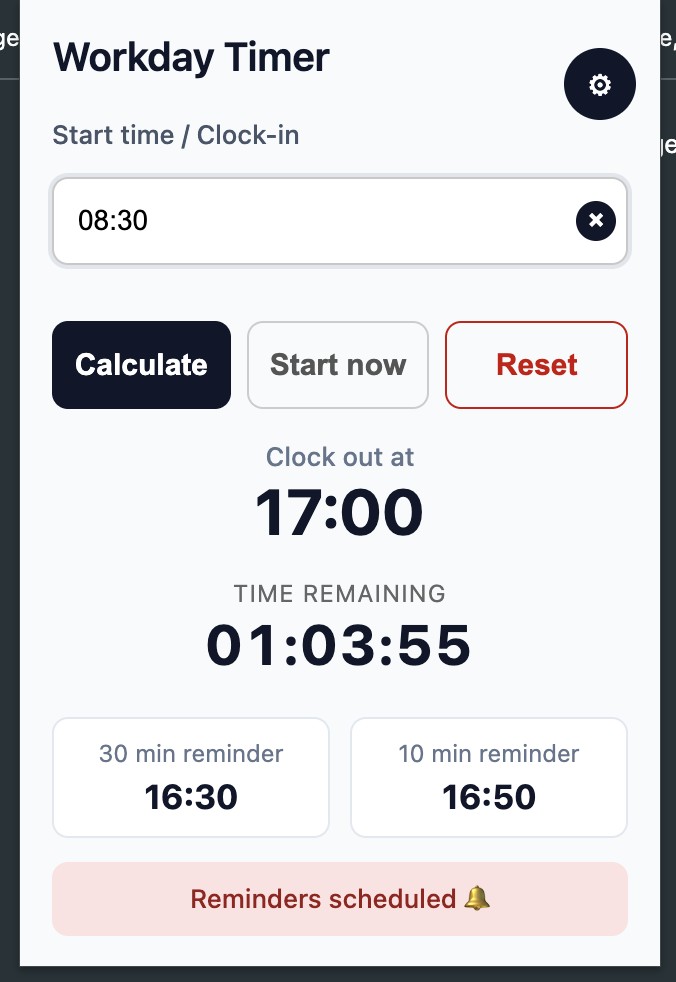
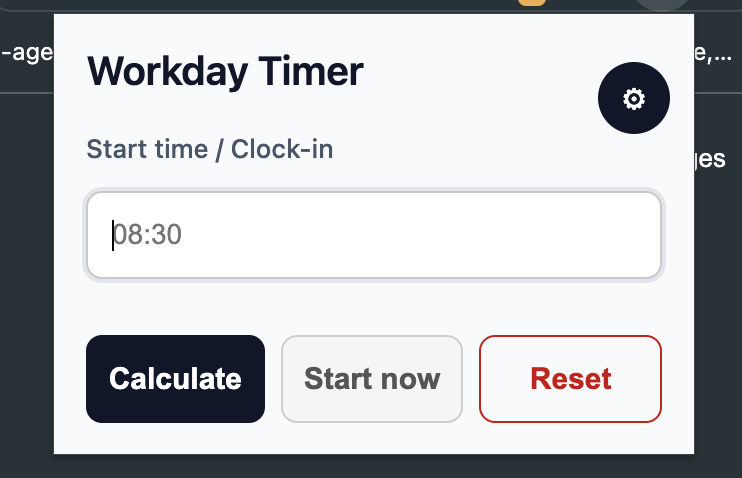
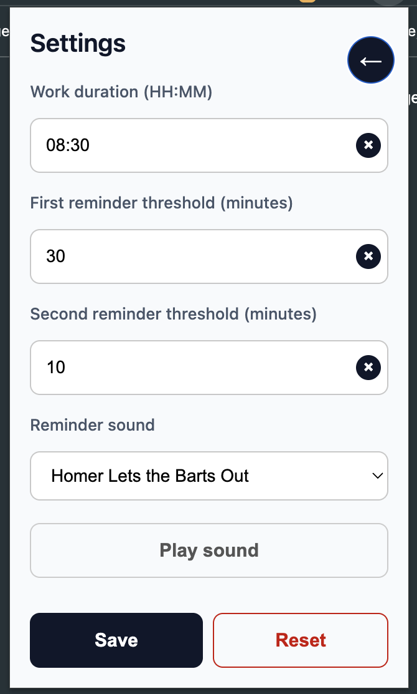
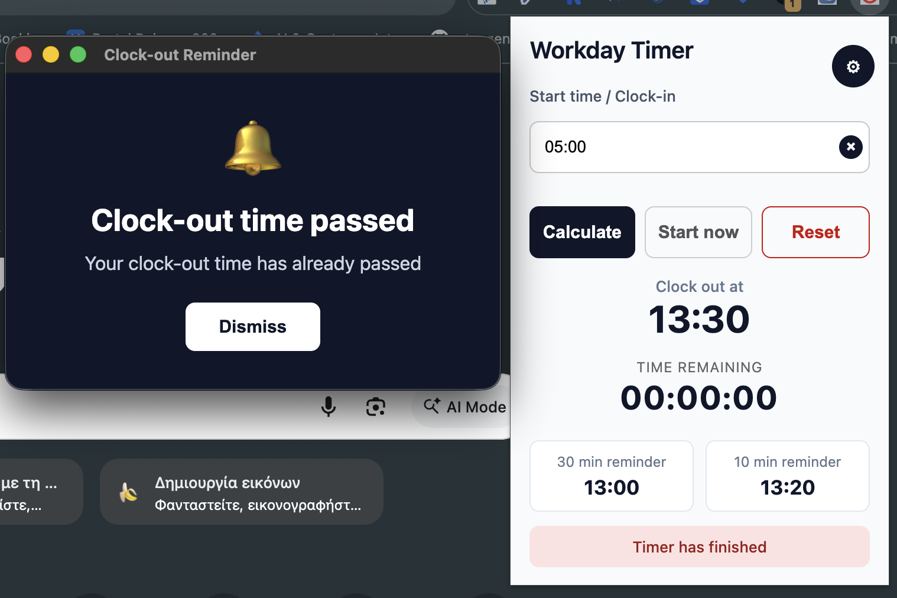

# Workday Timer Chrome Extension

A Chrome extension that calculates a clock-out time from a clock-in/start time and schedules reminder alerts before the end of the workday.

## Capabilities

- Calculates clock-out time from a user-entered start time
- Shows a live countdown to clock-out
- Schedules reminder alerts before clock-out
- Supports two configurable reminder thresholds
- Persists settings in `chrome.storage.local`
- Supports a selectable reminder sound from `src/assets/sounds`
- Falls back to the default built-in reminder sound if no custom sound is selected
- Shows a reminder window when alerts fire
- Stops the sound when the reminder window is dismissed
- Light/Dark theme suuport

## Settings

The extension stores the following values locally:

- `workDurationMinutes`
- `startTime`
- `clockOut`
- `clockoutTimestamp`
- `reminder30Minutes`
- `reminder10Minutes`
- `selectedRingSound`
- `themeMode`

Default reminder thresholds:

- First reminder: `30` minutes
- Second reminder: `10` minutes

## Sound selection

The settings UI includes a dropdown for reminder sound selection.  
Any audio file under `src/assets/sounds/` can be used if it is listed in the dropdown options.

If no custom sound is selected, the extension uses the default reminder tone.

## Main flow

1. Enter a clock-in time in the popup
2. Click **Calculate**
3. The extension shows:
   - clock-out time
   - countdown
   - reminder times
4. Reminder alerts are scheduled automatically
5. Dismissing the reminder window stops the sound

## Project structure

- `src/popup/` — main popup UI and timer logic
- `src/background/` — alarm scheduling and reminder window handling
- `src/reminder/` — reminder alert window
- `src/offscreen/` — audio playback
- `src/assets/sounds/` — custom reminder sounds
- `src/assets/img/` — extension icons

## Storage

The extension uses `chrome.storage.local` to persist:

- reminder thresholds
- selected sound
- saved clock-in / clock-out values

## Notes

- The extension relies on Chrome alarms and an offscreen document for audio playback.
- Reminder alerts are rescheduled automatically when settings change.

## HRMS / myErgani integration

The extension can also interact with your Company's HRHub page:

- When **Start now** is clicked in the extension, the current time is written to the start-time input
- The extension can trigger the HRHub **Check In / In** button automatically on:
  - `https://hrms.mycompany.com/*`
- This is done through a content script that listens for a message from the extension popup
- If the HRHub button is not available yet, the page may need to finish loading before the click is triggered

### Notes

- The extension must be reloaded after manifest changes
- The HRHub page must be refreshed after installing the content script
- The page must match the extension host permissions and content script match rules

### Important

- You must also update `manifest.json` with your HRMS hub URL in:
  - `host_permissions`
  - `content_scripts.matches`
- Replace `https://hrms.mycomany.com/*` with the real HRMS hub URL before using the integration.
- The extension must be reloaded after manifest changes.
- The HRHub page must be refreshed after installing the content script.

## Installation

### Install the extension in Chrome

1. Clone or download this repository to your machine.
2. Open Chrome and go to `chrome://extensions/`.
3. Enable **Developer mode** in the top-right corner.
4. Click **Load unpacked**.
5. Select the project folder:
   - `chrome.ext.workday-timer`
6. The extension will appear in Chrome and can now be used from the extensions menu.

### Update the extension after changes

If you make changes to the code:

1. Go to `chrome://extensions/`
2. Click **Reload** on the extension
3. Refresh any open tabs where the extension is used

### Screenshots

